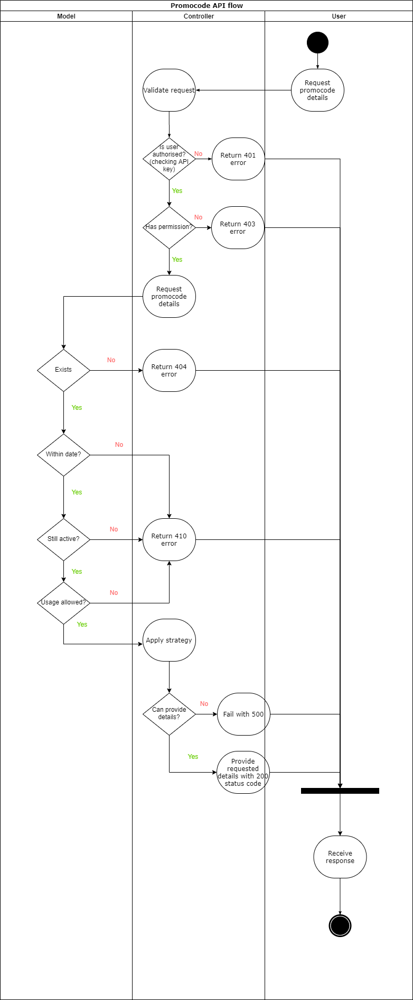
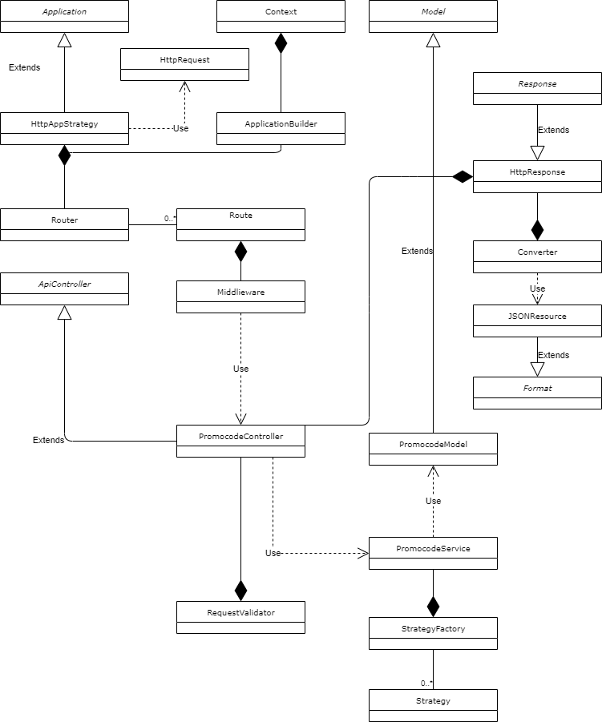

# Uniqodo test

## Problem #1
Using diagrams only, design the code Validation API architecture showcasing the core
components only .i.e. the flow of logic from the controller to concrete models- the MVC
structure. Exclude the database and other infrastructure details (e.g. web servers, routing,
frameworks code e.t.c) from your design.

Class diagrams (including method names) and a sketch of how different parts of the
application interact will suffice. No codes required for this part.

## Solution for problem #1   
For the following problem going to provide 3 UML diagrams:
- Package diagram to show actors and application layers and how they depend on each other
- Activity diagram to show flow, logical step decision chain
- Class diagram to show low level static structure of classifiers in a system and their relationships

### Package diagram

### Activity diagram

### Class diagram

## Problem 2
Below is a set of standard rules, just to mention a few, for a code to be valid:
- Code exists in the system
- Code status is active
- The code is in date
- The code being checked by a client belongs to the client account
- Has not exceeded its usage allowance

Please note that this is not the full list of rules.

Please provide some codes for your classes here including methods necessary for validating a
promotional code against the rules. You don’t have to show the complete code for the methods
just as long as they show intentions with classes and methods. Also, you can ignore other parts
of the architecture like database queries here.

## Solution for problem #2
In repository I've provided app prototype. Methods have some code or empty.
My main focus was to decompose problems into separate classes. For validation strategy pattern would
work the best. I just put general rules for it - depending on context this ruleset might be different.
The current solution can be also improved by using Facade design pattern. I haven't used it for
better readability and saving time.

## Problem 3
Uniqodo would like to be notified about any unhandled exception that occurs in the API. What
solution would you put in place in order to achieve this? A simple explanation will suffice here.   

## Solution for problem #3
Create 2 separate modules:
- SessionWatcher
- ErrorHandler

First one would watch and record all requested endpoints to table session_history. 
This table would contain following fields:
* id
* route_name
* route_id
* status_code
* exception_message
For unhandled exception it will create a record with status_code 5xx with exception message.
This module responsibility is just to record it to DB.

ErrorHandler service can be added to cron or queue that would execute a command.
That can provide reports in multiple formats depending on driver or context e.g. email, slack and etc.
This module responsibility is to read from session_history and provide reports in readable format.

Solution can be improved by adding a separate module SessionArchive. So all reported data
can be archived to a separate table. 
